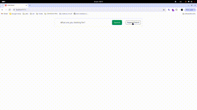

# Mini Mori

Simple and Powerful image engine search, that know NLP and use Vector search for find similar results.

## Demo



## Features

- vector search
- keyword search
- dockerized
- user-friendly interface

## BackEnd

In backend use Fastapi framework, meilisearch, qdrant, pytest

first set DataBase and virtualenv

Set Qdrant database:

```bash
docker pull qdrant/qdrant docker run -p 6333:6333 qdrant/qdrant
```

Set Meilisearch:

```bash
docker run -d --rm
--name meili-search
-p 7700:7700
-e MEILI_ENV='development'
-v $(pwd)/meili_data:/meili_data
getmeili/meilisearch
```

Now Set virtualenv:

```bash
python -m venv venv_name
```

active it in Linux:

```bash
source venv_name/bin/activate
```

## Run Locally

Clone the project

```bash
  git clone https://github.com/sina-mobarez/mini-Mori.git
```

Go to the project directory

```bash
  cd mini-Mori
```

Install dependencies

```bash
  cd backend
  pip install requirements.txt
```

Fill Qdrant Database
(exist a json file that contain 10000 products information by this command process images of products and store in vectordb):

```bash
  python scripts/process_images.py products.json batch-size
```

Fill Meilisearch Database [exist a json file that contain 10000 products information by this command indexing all products in database]:

```bash
  python scripts/load_products_to_meilisearch.py products.json
```

Start the server

```bash
  fastapi run
```

- Now you can use swagger or postman to call apis

## FrontEnd

User interface use Vue.js for run it:

```bash
  cd ../frontend
```

Install dependencies

```bash
  npm install
```

Start the server

```bash
  npm run dev
```

- [just for production] Compile and Minify for Production

```bash
  npm run build
```

## Running Tests

To run tests, run the following command

```bash
  pytest /tests
```

make sure you are in /backend.

## Contributing

Contributions are always welcome!

## Feedback

If you have any feedback, please reach out to us at mubarriizz@gmail.com

## License

[MIT](https://choosealicense.com/licenses/mit/)
